# ACS EMERGE — Authoring Guide

A reference for content authors working in **Document Authoring (DA)** on the ACS EMERGE site.
It explains how each block is built, what the rows/cells look like, which variants exist, and how
section styles (backgrounds) work.

- **Where you author:** [da.live/#/acs-ui/acs-emerge](https://da.live/#/acs-ui/acs-emerge)
- **Live site:** [dev--acs-emerge--acs-ui.aem.live](https://dev--acs-emerge--acs-ui.aem.live/)
- **Block Library:** every block below is available in DA's **Library panel → Blocks** — click a block to
  insert it pre-filled with sample content, then replace the text/images with your own.

---

## Table of Contents

1. [How blocks work in DA](#1-how-blocks-work-in-da)
2. [Section styles (backgrounds & layout)](#2-section-styles-backgrounds--layout)
3. [Block reference](#3-block-reference)
   - [Heroes & banners](#heroes--banners): [hero](#hero) · [hero-banner](#hero-banner) · [newsletter-banner](#newsletter-banner) · [event-hero](#event-hero)
   - [Cards & grids](#cards--grids): [cards](#cards) · [cards-emerge](#cards-emerge) · [cards-working](#cards-working) · [commitment-cards](#commitment-cards) · [client-cards](#client-cards) · [event-cards](#event-cards) · [team](#team)
   - [Text & structure](#text--structure): [columns](#columns) · [pillars](#pillars) · [challenge](#challenge) · [callout](#callout) · [agenda](#agenda) · [event-highlights](#event-highlights)
   - [People & quotes](#people--quotes): [profile](#profile) · [profile-details](#profile-details) · [quote](#quote) · [testimonial](#testimonial)
   - [Media & galleries](#media--galleries): [photo-gallery](#photo-gallery) · [gallery-carousel](#gallery-carousel)
   - [Success & clients](#success--clients): [success](#success) · [client-detail](#client-detail)
   - [Events extras](#events-extras): [recording](#recording) · [session-resources-carousel](#session-resources-carousel)
4. [The Back button](#4-the-back-button)
5. [Reusable content (query-index) blocks](#5-reusable-content-query-index-blocks)

---

## 1. How blocks work in DA

A **page** is a stack of **sections**. Each section holds either:

- **Default content** — plain headings, paragraphs, images, and links you type directly, or
- **Blocks** — structured components you insert from the Library.

A **block** is a small table. The **first row is the block name** (e.g. `Cards`), and each row below it
is one unit of content. Cells in a row map to the fields the block expects — the guide below shows the
row/cell shape for each block.

**Variants** add a style/behaviour option. In DA you write them in the block-name cell in parentheses —
`Cards (horizontal)`, `Profile (carousel)`, `Success (parallax)`. Multiple variants can combine where
noted.

**Images:** insert them directly in the cell. Uploaded images are automatically optimised — don't paste
external image URLs.

> **Tip:** the fastest way to author any block correctly is to insert it from **Library → Blocks**, which
> drops in the exact row structure with sample content. Then just edit the content.

---

## 2. Section styles (backgrounds & layout)

Backgrounds and a few layout behaviours are **section-level**, not block-level. You set them with a
**Section Metadata** block at the end of a section: a table whose first cell says `Style` and second cell
lists one or more style keywords.

| Style keyword | Effect |
|---------------|--------|
| `bg-muted` | Light grey background (`#f3f3f3`), black text. The standard "quiet" section. |
| `bg-gradient-a` | Red → magenta → violet gradient, white text. |
| `bg-gradient-b` | Magenta → violet → blue gradient, white text. |
| `bg-text-grey` | Softens the giant watermark background-text to a subtle grey (used with **Background Text**). |
| `center` | Centres the block and its carousel intro within the section. |

Two related **Section Metadata** keys:

- **Background Image** — sets a full-bleed background image on the section.
- **Background Text** — renders a giant watermark word behind the section (e.g. "Reflections", "Customer
  voice"). Pair with `bg-text-grey` to keep it subtle on light sections.

**Example Section Metadata table:**

| Section Metadata | |
|---|---|
| Style | bg-muted |
| Background Text | Customer voice |

> Any section can use these — they are independent of which block is inside. In the screenshots below, the
> grey and gradient backgrounds all come from these section styles.

---

## 3. Block reference

Each entry lists: what it's for, the row/cell structure, available variants, and section-style notes.

---

### Heroes & banners

#### hero

Full-width hero with a background image, heading, and CTA. The boilerplate hero (single-cell): all
content stacked in one cell.

**Rows**

| Row | Cell 1 |
|-----|--------|
| 1 | Background image, `H1` heading, description paragraph, one or more CTA links |

- **Variants:** none in active use.
- Insert from **Library → Blocks → Hero** for the exact shape.

---

#### hero-banner

The homepage hero — a looping background **video** (with an image poster fallback) behind a large
"EMERGE" wordmark. Authored with a video link and a poster image.

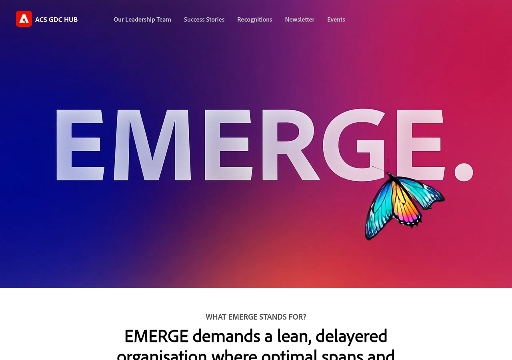

**Rows**

| Row | Cell 1 |
|-----|--------|
| 1 | A link to the background video (`.mp4`) and/or a poster `picture` |

- **Variants:** `has-video` is applied automatically when a video link is present.

---

#### newsletter-banner

A rounded banner with a background image on the right and an eyebrow + two-line title overlaid on a
brand gradient. Used at the top of the Newsletter page.

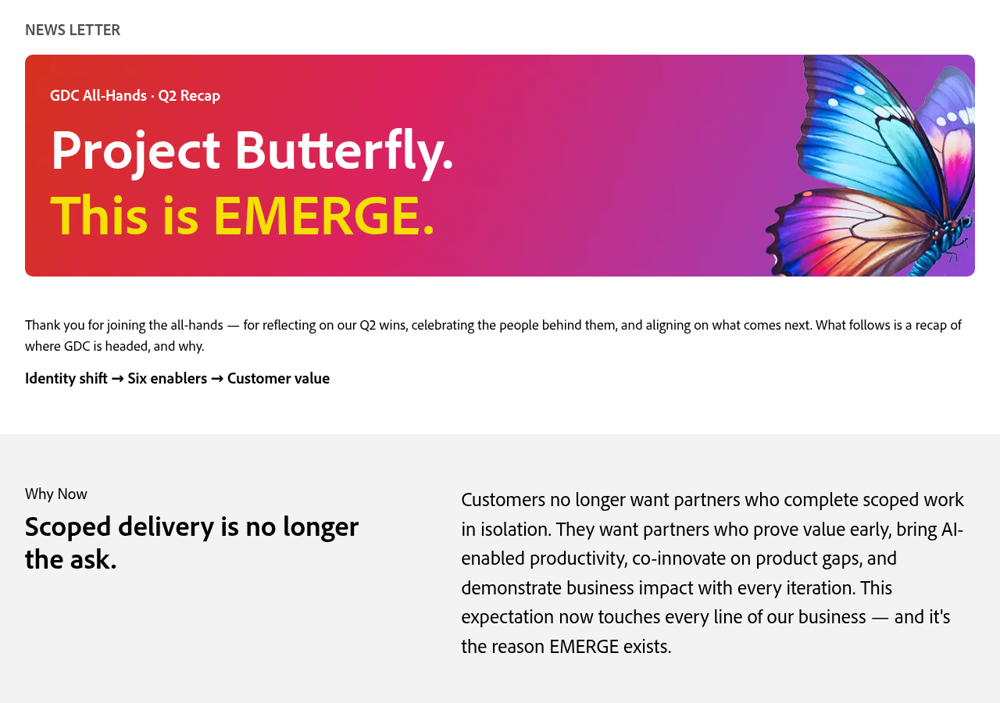

**Rows**

| Row | Cell 1 |
|-----|--------|
| 1 | Background image (`picture`) |
| 2 | Eyebrow paragraph, then the heading. The **last line** of the heading renders in the yellow accent colour. |

- The "NEWS LETTER" label and paragraphs below the banner are **default content**, not part of the block.
- **Variants:** none.

---

#### event-hero

The header of an event detail page: title + date on the left with an "About the Event" card and a
Timing/Duration/Community details card and a Register button, image on the right.

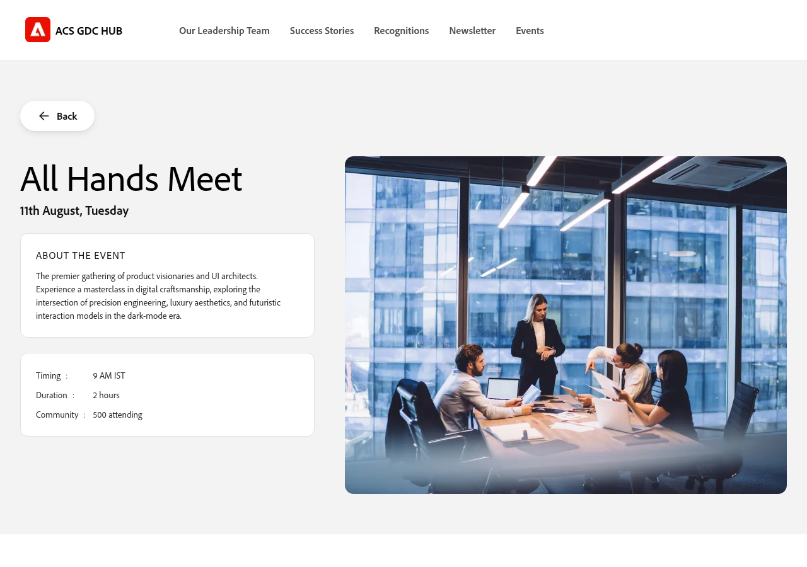

**Rows** (one cell each, in order)

| Row | Content |
|-----|---------|
| 1 | Event title (`H1`) + date paragraph |
| 2 | "About the Event" label + body paragraph(s) → renders as the bordered card |
| 3 | Detail lines as `Label : Value` (Timing, Duration, Community) → renders as the details card |
| 4 | A CTA link (e.g. "Register Now") |
| 5 | The event image |

- **Variants:** none.

---

### Cards & grids

#### cards

Standard card grid — image + title + description + link, one card per row.

**Rows** (2 cells per card)

| Cell 1 | Cell 2 |
|--------|--------|
| Card image | `H3` title, description, CTA link |

- **Variants:** none in active use.

---

#### cards-emerge

The "What EMERGE stands for" acronym list: an intro (eyebrow + heading) row, then one row per letter —
a big letter in cell 1 and a title + subtitle in cell 2.

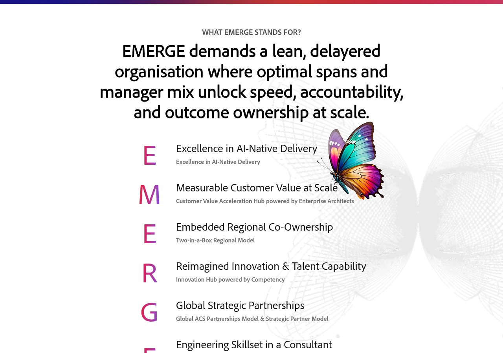

**Rows**

| Row | Cell 1 | Cell 2 |
|-----|--------|--------|
| 1 (intro) | Eyebrow paragraph + heading | *(single cell)* |
| 2…n | The letter (e.g. `E`) | Title paragraph + subtitle paragraph |

- **Variants:** none.

---

#### cards-working

Tilted, overlapping image cards with a title + description overlaid — the "Working the EMERGE way"
section. Intro (eyebrow + heading) as default content above, then one row per card.

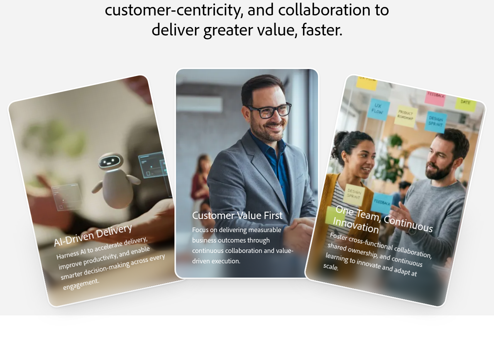

**Rows** (per card)

| Cell 1 | Cell 2 |
|--------|--------|
| Card image | `H3` title + description |

- **Variants:** the tilted look is applied automatically.

---

#### commitment-cards

Text-only elevated cards — eyebrow + heading + body, shown two-up. Used for the "Two commitments"
section. Intro (eyebrow + heading) is default content above the block.

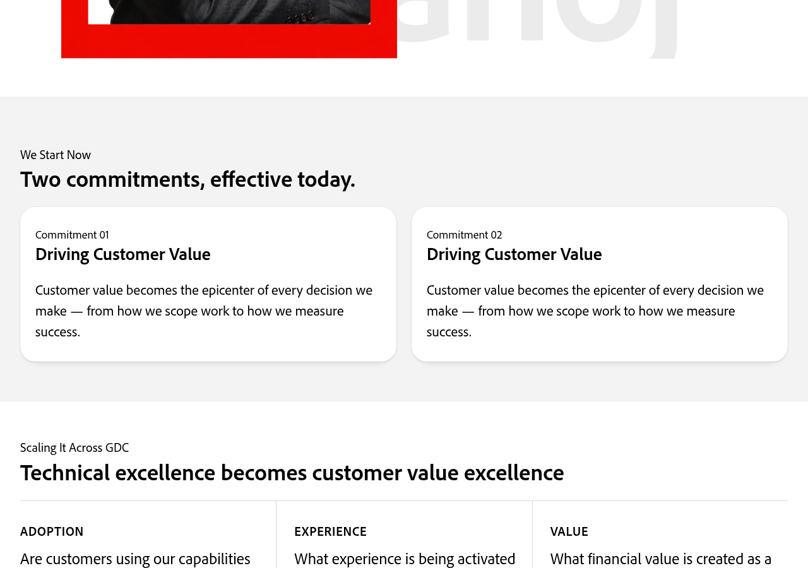

**Rows** (one cell per card)

| Row | Cell 1 |
|-----|--------|
| 1…n | Eyebrow (e.g. "Commitment 01"), `H4` heading, body paragraph |

- **Variants:** none. Often placed in a `bg-muted` section.

---

#### client-cards

A grid of client cards — logo + title + description — each linking to a client detail page. Can also be
driven from the clients index (see [section 5](#5-reusable-content-query-index-blocks)).

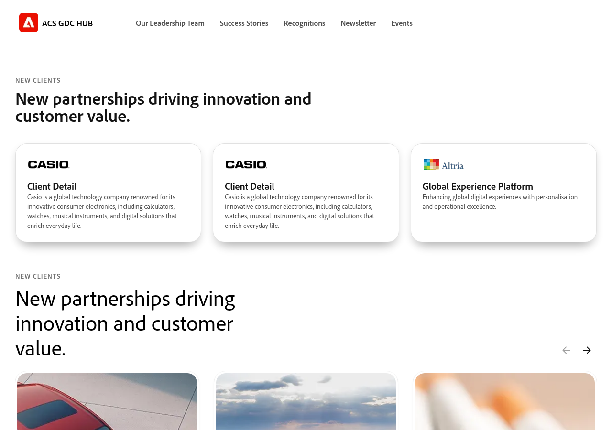

**Rows**

| Row | Cell 1 |
|-----|--------|
| 1 (intro, optional) | Eyebrow + heading |
| 2…n | Logo image, `H3` title, description (or a single link to `clients/query-index.json`) |

- **Variants:** `carousel` — scrolls with prev/next nav instead of a static grid.

---

#### event-cards

Event cards with a date badge (month/day/weekday), title, and meta (time · duration · attendees). Driven
from the events index — you author just an intro + a link to `events/query-index.json`.

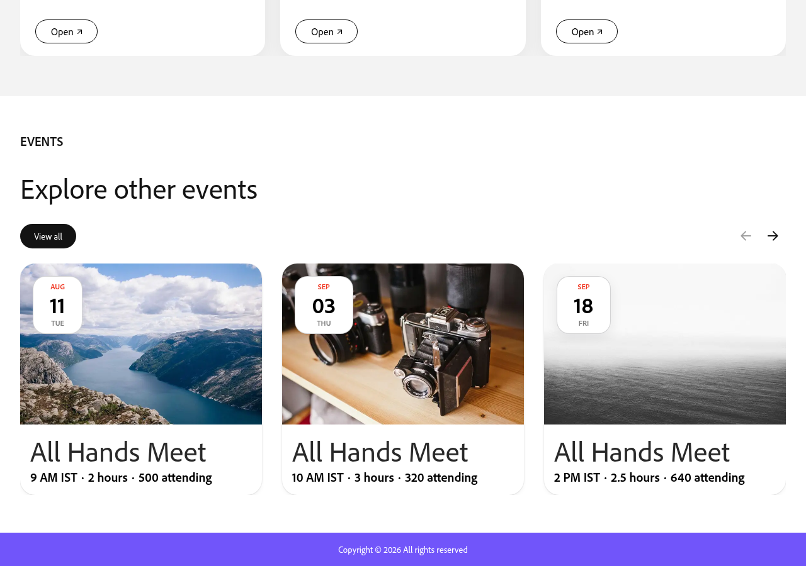

**Rows**

| Row | Cell 1 |
|-----|--------|
| 1 (intro) | Eyebrow + heading, optional "View all" link |
| 2 | A link to `events/query-index.json` |

- **Variants:** `carousel` — the "Explore other events" strip uses this.

---

#### team

A responsive grid of team-member photos with a `Name | Role` caption.

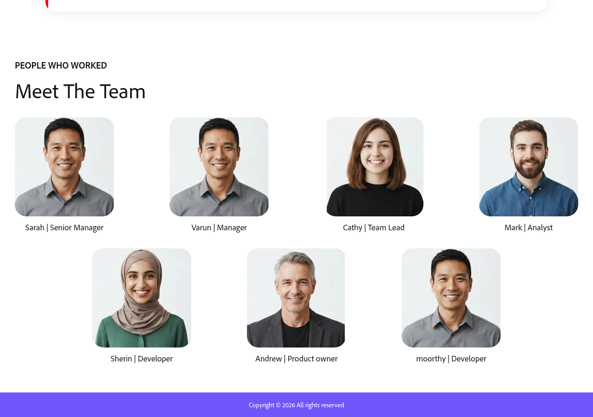

**Rows** (per member)

| Cell 1 | Cell 2 |
|--------|--------|
| Member photo | `Name | Role` (one paragraph) |

- The eyebrow + heading ("PEOPLE WHO WORKED / Meet The Team") is default content above the block.
- **Variants:** none.

---

### Text & structure

#### columns

Two (or more) side-by-side columns of default content — the number of columns matches the number of cells
in the first row. Stacks on mobile.

**Rows**

| Cell 1 | Cell 2 |
|--------|--------|
| Column 1 content (text, image, or both) | Column 2 content |

- **Variants:** none — column count is automatic (`columns-2-cols`, etc.). Background comes from section
  styles.

---

#### pillars

An intro (eyebrow + heading) above a horizontal rule, then a row of labelled text columns with vertical
dividers (e.g. ADOPTION / EXPERIENCE / VALUE).

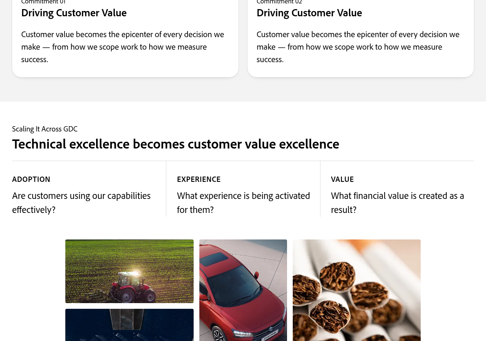

**Rows**

| Row | Cell 1 |
|-----|--------|
| 1 (intro) | Eyebrow + heading |
| 2…n | A label paragraph + a description paragraph → one pillar |

- **Variants:** none.

---

#### challenge

Numbered items — a big number in cell 1, a label + description in cell 2. Used for
Challenge / Solution / Outcome sequences on client & success pages.

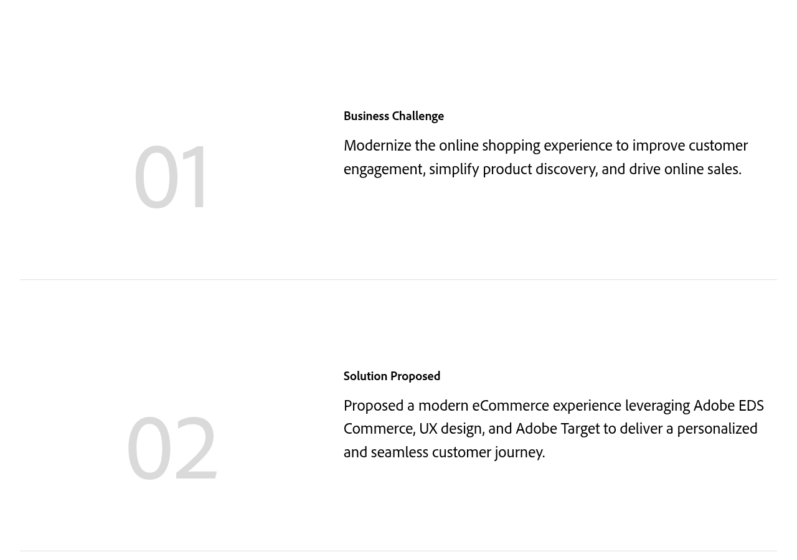

**Rows** (per item)

| Cell 1 | Cell 2 |
|--------|--------|
| The number (e.g. `01`) | Label paragraph + description paragraph |

- **Variants:** none.

---

#### callout

A centered prompt — eyebrow + heading + paragraph + a pill button + a small note. Used for the
"two-way conversation" section.

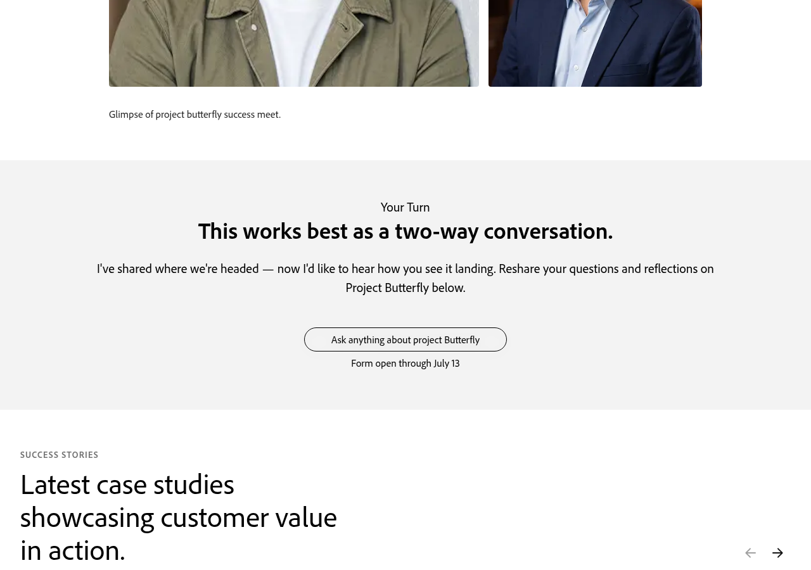

**Rows**

| Row | Cell 1 |
|-----|--------|
| 1 | Eyebrow, heading, body paragraph, a CTA link, then a note paragraph after it |

- **Variants:** none. Usually in a `bg-muted` section.

---

#### agenda

A schedule: an intro (eyebrow + heading), then one row per session — time / title + speaker / duration.

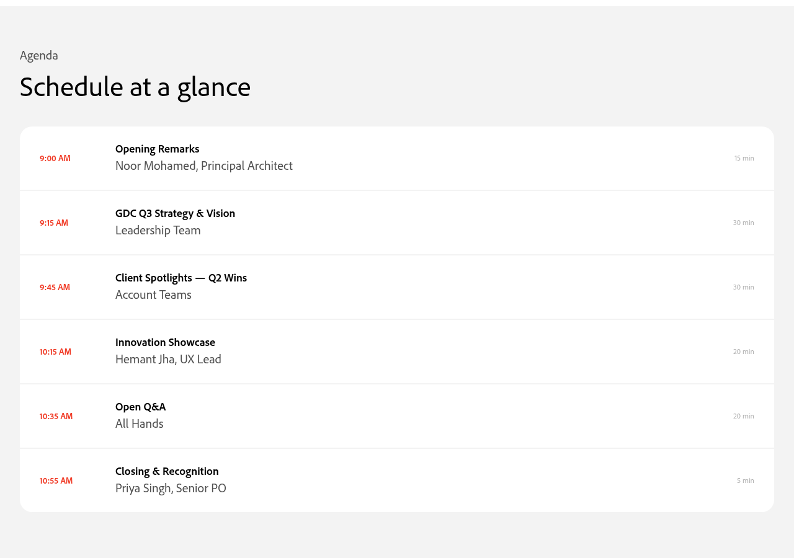

**Rows**

| Row | Cell 1 | Cell 2 | Cell 3 |
|-----|--------|--------|--------|
| 1 (intro) | Eyebrow + heading | | |
| 2…n | Start time (e.g. `9:00 AM`) | Session title (`H4`) + speaker paragraph | Duration (e.g. `15 min`) |

- **Variants:** none. Usually in a `bg-muted` section.

---

#### event-highlights

Key stats — an intro (eyebrow + heading), then one row per stat: an icon + a big value + a label.

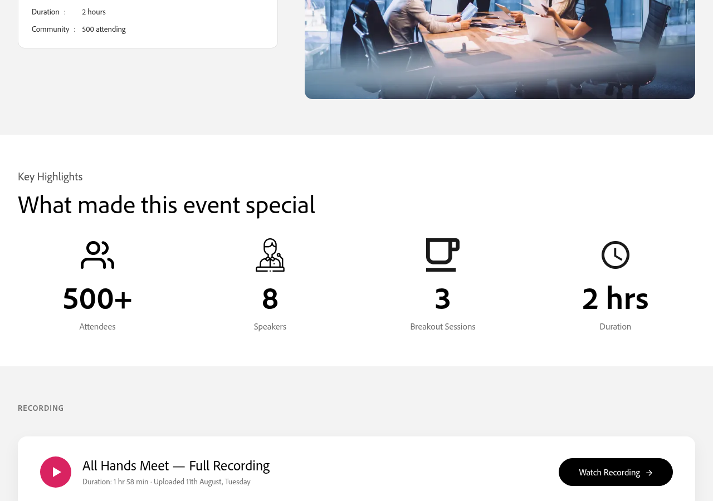

**Rows**

| Row | Cell 1 | Cell 2 |
|-----|--------|--------|
| 1 (intro) | Eyebrow + heading | *(single cell)* |
| 2…n | An icon (image or icon token) | Value paragraph (e.g. `500+`) + label paragraph (e.g. `Attendees`) |

- **Variants:** none.

---

### People & quotes

#### profile

Leadership cards — photo, name, role, with a bio revealed on hover. Can be authored as rows or driven
from the leaders index (see [section 5](#5-reusable-content-query-index-blocks)).

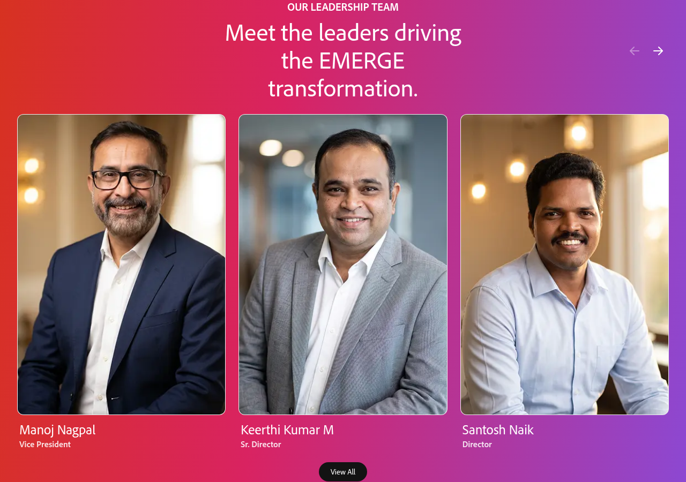

**Rows** (per person)

| Cell 1 | Cell 2 |
|--------|--------|
| Portrait photo | Name (`H3`), role paragraph, optional bio paragraph(s) |

- **Variants:**
  - `carousel` — horizontally scrolling with prev/next nav (shown above).
  - `overlap` — name/role/bio sit in an always-visible glass overlay on the image.
  - can combine (`Profile (carousel, overlap)`).
- Works well on `bg-gradient-a` / `bg-gradient-b` sections (white text).

---

#### profile-details

The top of a leader detail page — a large portrait beside the name, role, and a Background heading + bio.

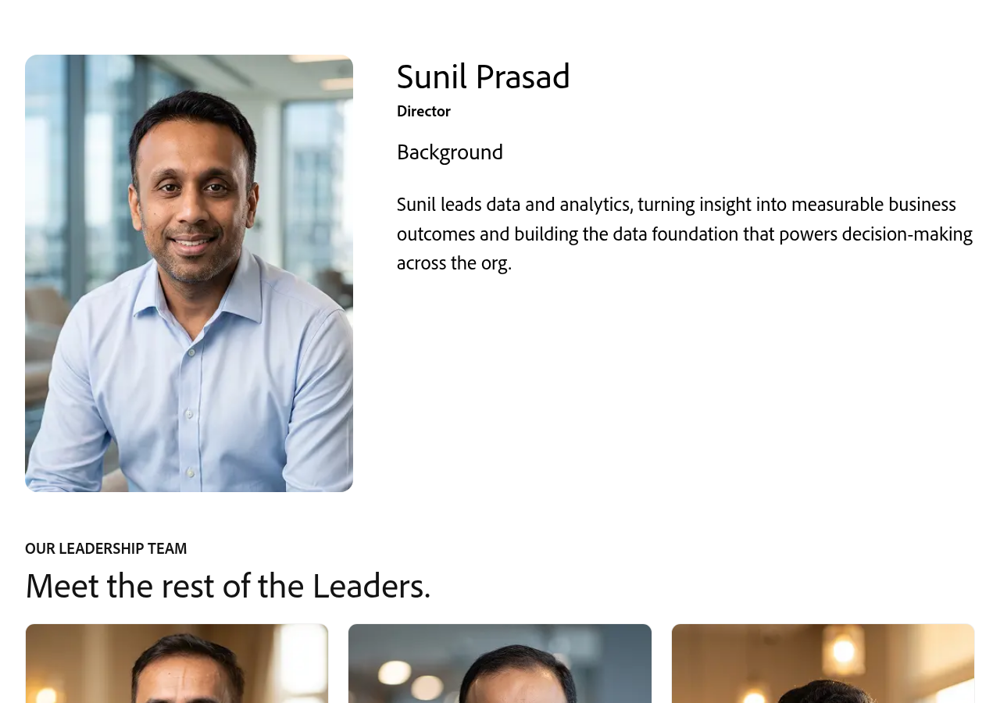

**Rows**

| Cell 1 | Cell 2 |
|--------|--------|
| Portrait photo | Name (`H2`), role, "Background" heading, bio paragraph |

- **Variants:** none.

---

#### quote

A pull-quote. Default: large quotation text with a soft watermark name behind it. `card` variant: a
white card with a left accent bar, quote mark, and an avatar + attribution.

| Default | Card variant |
|---------|--------------|
| 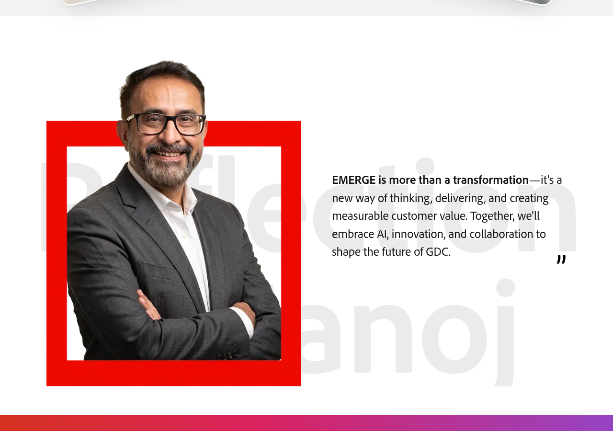 | 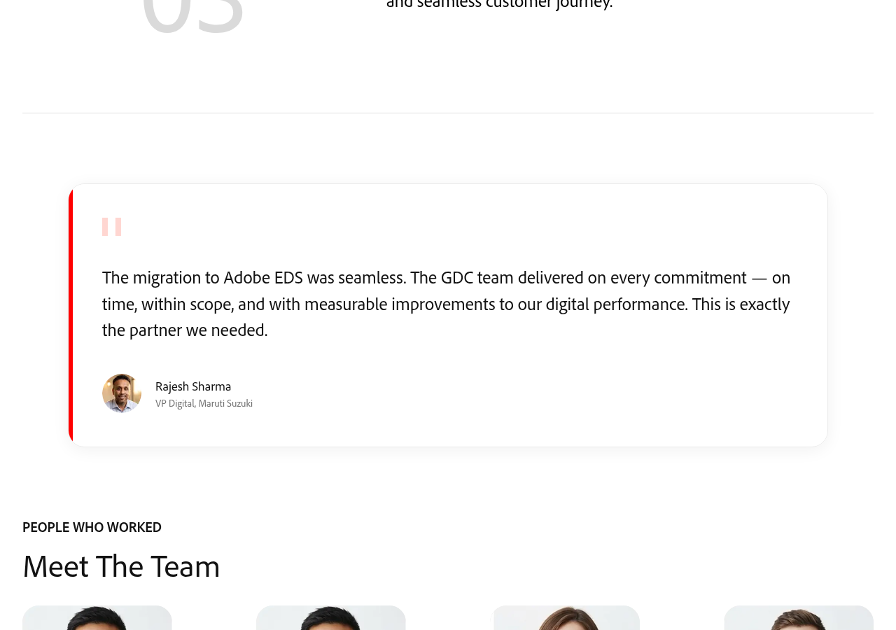 |

**Rows**

| Cell 1 | Cell 2 (card variant) |
|--------|-----------------------|
| The quotation (bold the emphasised part) | Optional avatar image; attribution name + title |

- **Variants:** `card` — boxed layout with avatar + attribution (shown right).
- Pair the default with a **Background Text** section for the watermark name.

---

#### testimonial

A testimonial carousel — quote + author photo + name/title, with prev/next nav. Usually on a gradient
section with a "Customer voice" background text.

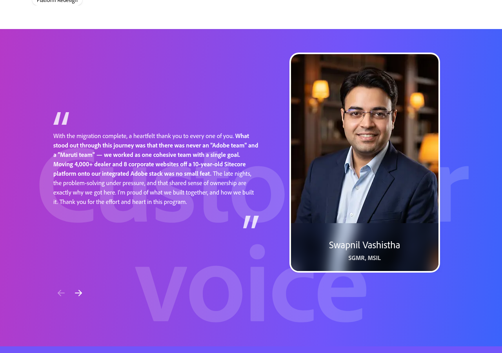

**Rows** (per testimonial)

| Cell 1 | Cell 2 |
|--------|--------|
| Quote (bold the emphasised part) | Author photo, name (`H3`), title |

- **Variants:** none (the carousel is built in).

---

### Media & galleries

#### photo-gallery

A masonry photo collage with an optional caption. Default: a repeating tiled grid. `feature` variant: a
large hero image on the left with a 2×2 grid of smaller images.

| Default (masonry) | Feature variant |
|-------------------|-----------------|
| 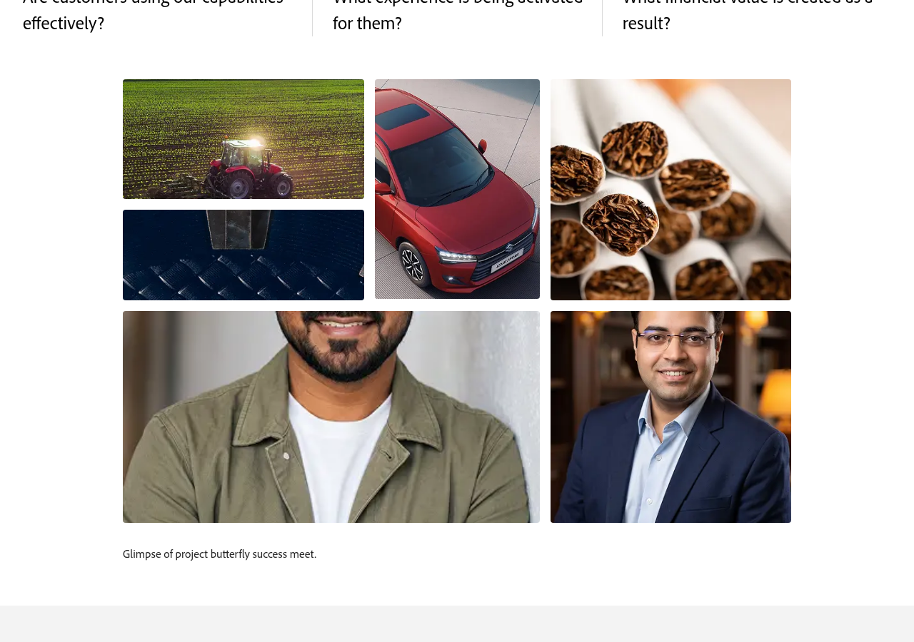 | 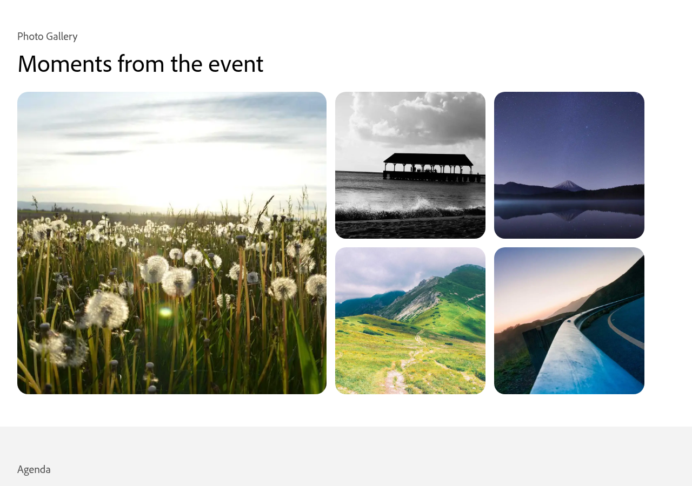 |

**Rows**

| Row | Cell 1 |
|-----|--------|
| 1…n | One image per row |
| last (optional) | A caption paragraph (no image) |

- The eyebrow + heading ("PHOTO GALLERY / Moments from the event") is default content above the block.
- **Variants:** `feature` — hero + 2×2 layout.

---

#### gallery-carousel

A swipeable carousel of large screenshots/images with prev/next nav and dots. Used on success stories to
show delivered work.

**Rows**

| Row | Cell 1 |
|-----|--------|
| 1…n | One image per slide |

- **Variants:** none (the carousel is built in).

---

### Success & clients

#### success

Case-study cards — image, title, description, and tags — linking to success-story pages. Can be authored
as rows or driven from the success index (see [section 5](#5-reusable-content-query-index-blocks)).

| Carousel variant | Parallax variant |
|------------------|------------------|
| 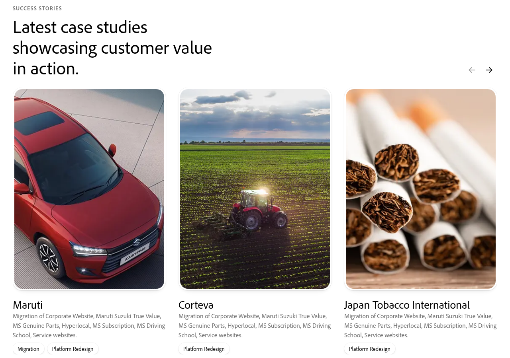 | 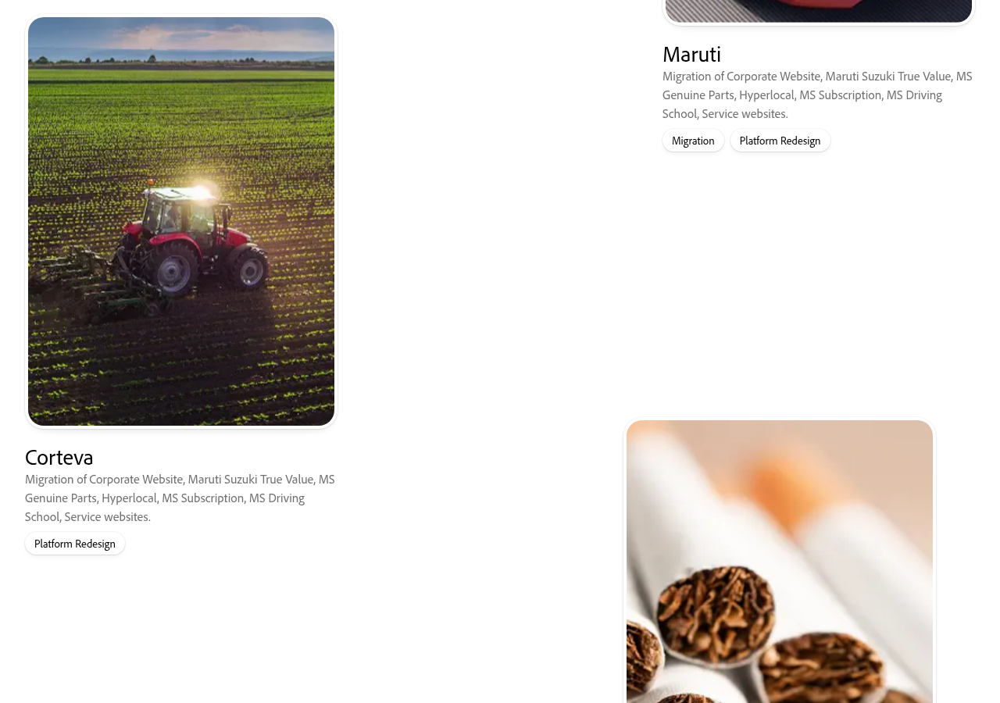 |

**Rows** (per story, when authored directly)

| Cell 1 | Cell 2 |
|--------|--------|
| Story image | `H3` title, description, tag list |

- **Variants:**
  - `carousel` — horizontally scrolling with prev/next nav.
  - `parallax` — images pan gently on scroll in a stacked layout.

---

#### client-detail

The top of a client/success detail page — client logo, a hero image, a DETAILS list
(Client / Industry / Tags), and an ABOUT THE CLIENT description.

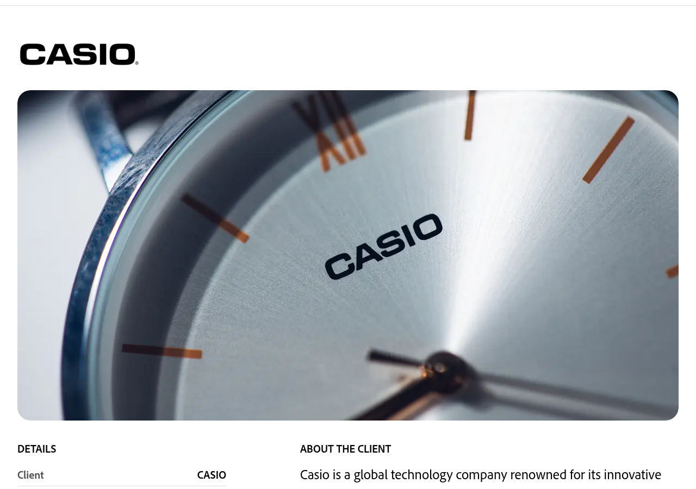

**Rows**

| Row | Content |
|-----|---------|
| 1 | Client logo + hero image |
| 2 | `Client : …`, `Industry : …`, optional `Tags : a, b, c` |
| 3 | "About the Client" label + description |

- **Variants:** none.

---

### Events extras

#### recording

A recording card — a play glyph, the recording title, meta (duration · upload date), and a
"Watch Recording" button. **The button opens the video URL in a new tab — there is no in-page player.**

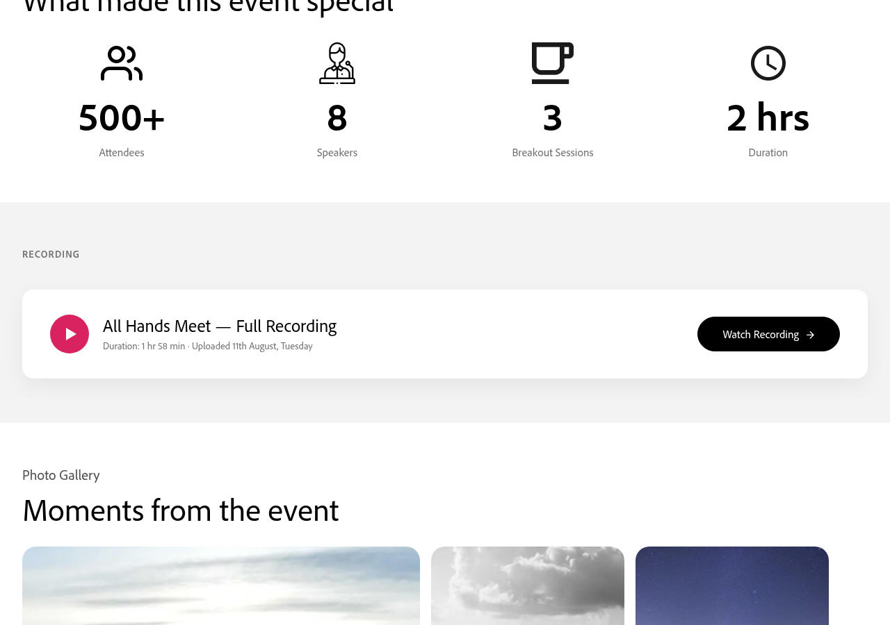

**Rows**

| Row | Cell 1 |
|-----|--------|
| 1 | Eyebrow ("RECORDING"), title (`H3`), meta paragraph, and a link whose text is the button label and whose URL is the video |

- **Variants:** none. Usually in a `bg-muted` section.

---

#### session-resources-carousel

Resource cards — title + description + an "Open" link — shown 3-up and scrollable. On hover a card lifts
and its "Open" button fills red.

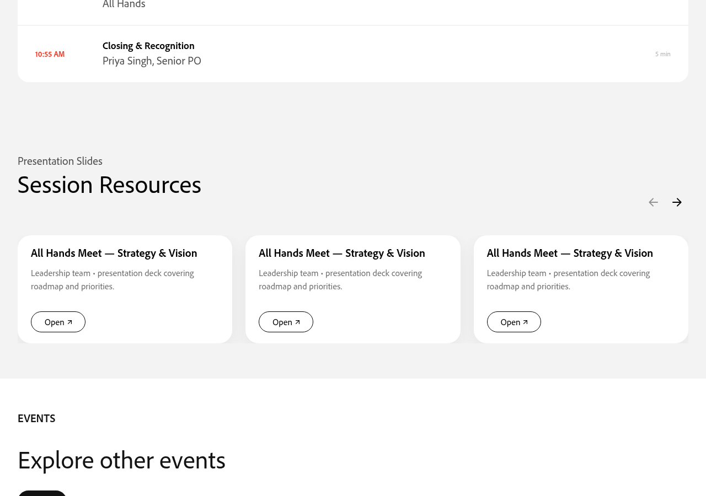

**Rows**

| Row | Cell 1 |
|-----|--------|
| 1 (intro) | Eyebrow + heading |
| 2…n | `H3` title, description, an "Open" link (opens in a new tab) |

- **Variants:** the carousel behaviour is built in.

---

## 4. The Back button

On **detail pages** — any page under `/leaders/`, `/success-stories/`, or `/events/` — a **Back** button
is added automatically at the top of the page (see it in the event-hero and profile-details screenshots
above). It uses the browser's history to return the visitor to wherever they came from. Authors don't
need to add anything; it appears on detail pages and is hidden when there's no in-site history.

---

## 5. Reusable content (query-index) blocks

Some blocks can build their content **automatically** from a listing instead of being authored card by
card. Instead of adding each card, you author only an intro and a single link to a `query-index.json`
sheet, and the block fills itself from the published pages:

| Block | Index it can read |
|-------|-------------------|
| `profile` | `/leaders/query-index.json` — all leader pages |
| `client-cards` | `/clients/query-index.json` — all client pages |
| `success` | `/success-stories/query-index.json` — all success stories |
| `event-cards` | `/events/query-index.json` — all event pages |

**How it works:** each detail page carries page metadata (title, image, date, etc.). When published, it's
added to its index automatically. A block pointed at that index shows a card for every page — so new
detail pages appear in the listing without editing the listing block. The current page is excluded
automatically.

To author one, insert the block, add the intro row, and put a link to the relevant `query-index.json` in
the next row (this is what the Library sample for these blocks shows).

---

*Questions or a block that doesn't behave as documented? Flag it to the development team.*
